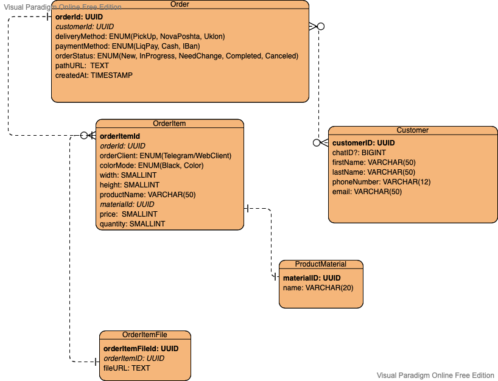

# ERD Diagram



# Table `order`
``` 
orderId
customerId

deliveryMethod      // PickUp/NovaPoshta/Uklon
paymentMethod       // LiqPay/Cash/IBan

orderStatus         // NEW, IN_PROCESS, NEED_CHANGE, COMPLETE, CANCELED
pathURL

createAt   // date
```

# Table `order_items`
``` 
orderId
orderItemId

orderClient // Telegram/Web client

colorMode

width
height

name

material
price
quantity
```

# Table `order_item_files`
``` 
orderItemsFileId
orderItemId
fileURL
```

# Table `customer`
``` 
customerId
chatId?
firstName
secondName
phoneNumber
email?
```


# Propositions v2
# Table `telegram_customer`
``` 
customerId
chatId
email
```

# Credentials

# Data Base URL `jdbc:postgresql://localhost:5432/paperfoxdb`